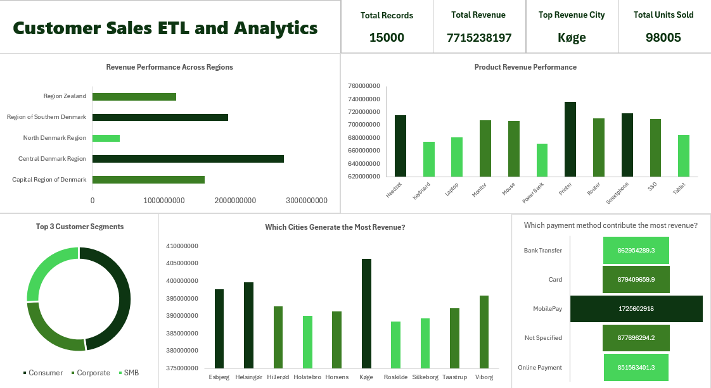
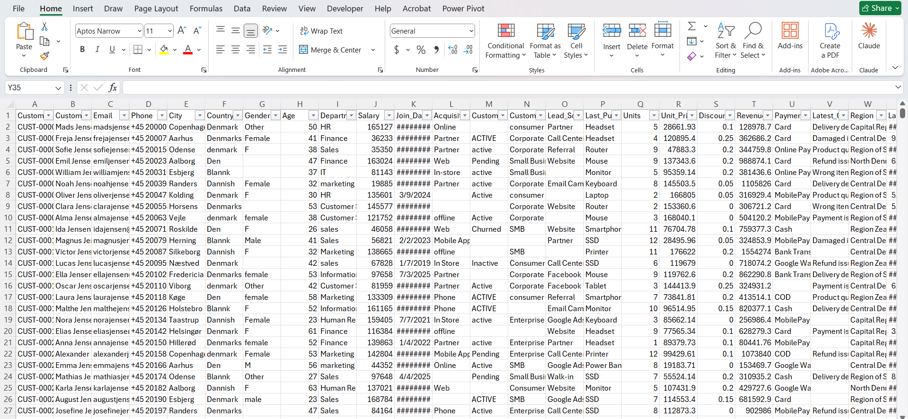
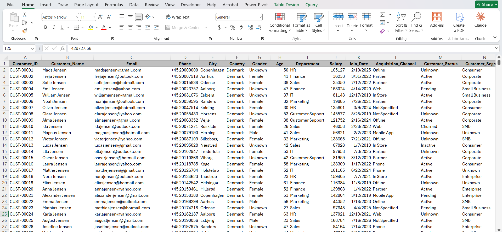

# Customer Sales ETL and Analytics — Power Query & Excel

An ETL and analytics project built in Excel using Power Query. Raw, messy Danish customer sales data was extracted, cleaned, transformed, and loaded into a structured format — then analyzed through a multi-visual Excel dashboard covering revenue, product performance, regional trends, and payment methods.

---

## Project Overview

Real-world data is almost never clean. This project simulates the full data pipeline a business analyst would run before any reporting can begin — starting with genuinely messy source data and ending with a polished, insight-ready dashboard.

The dataset covers 15,180 Danish customer records with intentional quality issues including inconsistent casing, mixed gender values, blank fields, inconsistent country spellings, and non-standardized categorical values — all resolved through Power Query transformations before any analysis was performed.

---

## Dashboard Preview

---

## Raw Data vs Cleaned Data 

### Raw Data (Before Cleaning)

### Cleaned Data (After Power Query)

---

## Dashboard KPIs

| Metric | Value |
|--------|-------|
| Total Records | 15,000 |
| Total Revenue | 7,715,238,197 |
| Top Revenue City | Køge |
| Total Units Sold | 98,005 |

---

## ETL Process — What Was Cleaned

The raw CSV (`Danish_Messy_Customer_Sales_Data.csv`) contained multiple data quality issues across its columns. Here is what was identified and fixed in Power Query:

### Data Quality Issues Fixed

| Column | Issue Found | Fix Applied |
|--------|-------------|-------------|
| `Gender` | Mixed values: "F", "female", "Other", blank | Standardized to Female / Male / Unknown |
| `Country` | Inconsistent: "Denmark", "Denmarks", "Den", "Dannish", "Blankk" | Standardized to "Denmark" |
| `Department` | Mixed casing: "HR", "hr", "sales", "marketing" | Proper case applied |
| `Acquisition_Channel` | "Not Specified", blank, inconsistent | Standardized |
| `Customer_Status` | "ACTIVE", "active", "Active" mixed casing | Standardized to proper case |
| `Join_Date` | Showing as `########` (column too narrow) | Formatted correctly as date |
| `Salary` | Inconsistent formatting | Cleaned and typed as number |
| Blank cells | Various columns had missing values | Filled or flagged appropriately |

---

## Workbook Structure

This project is organized across multiple sheets:

| Sheet | Purpose |
|-------|---------|
| Raw_Data (via Power Query) | Connected source from the CSV file |
| Cleaned_Data | Transformed output after all Power Query steps |
| Data_Quality_Log | Documentation of the transformation actions performed in Power Query |
| Pivot_Summary | Created summary tables from Cleaned_Data using Pivot Tables |
| Dashboard | Final analytics view with charts and KPI cards |

---

## Dashboard Sections

**1. KPI Summary Cards**
- Total Records: 15,000
- Total Revenue: 7.7 Billion
- Top Revenue City: Køge
- Total Units Sold: 98,005

**2. Revenue Performance Across Regions**
- Horizontal bar chart comparing revenue across Denmark's 5 regions
- Central Denmark Region and Region of Southern Denmark lead in total revenue

**3. Product Revenue Performance**
- Bar chart comparing revenue across 11 product categories: Headset, Keyboard, Laptop, Monitor, Mouse, Power Bank, Printer, Router, Smartphone, SSD, and Tablet
- Printer and Router recorded the highest product revenues

**4. Top 3 Customer Segments**
- Donut chart showing revenue split across: Consumer, Corporate, and SMB segments

**5. Which Cities Generate the Most Revenue?**
- Bar chart comparing 10 major Danish cities by revenue
- Køge recorded the highest city-level revenue, significantly ahead of other cities

**6. Which Payment Method Contributes the Most Revenue?**
- Horizontal bar chart comparing 5 payment methods: Bank Transfer, Card, MobilePay, Not Specified, and Online Payment
- MobilePay dominates at 1,725,602,918 — nearly double the next highest method

---

## Tools & Features Used

| Feature | Purpose |
|---------|---------|
| Power Query (ETL) | Extract, clean, and transform raw CSV data |
| Data Type Conversion | Correcting dates, numbers, and text fields |
| Value Standardization | Fixing inconsistent gender, country, status values |
| Proper Case / Trim | Resolving mixed casing and whitespace issues |
| Pivot Tables | Aggregating cleaned data for dashboard visuals |
| Bar Charts | Revenue by region, product, city, payment method |
| Donut Chart | Customer segment distribution |
| KPI Cards | Summary metrics at the top of the dashboard |
| Excel Table Formatting | Structured, filterable data layout |

---

## Files in This Repository

| File | Description |
|------|-------------|
| `Danish_Messy_Customer_Sales_Data.csv` | Raw source data with intentional quality issues |
| `Customer_Sales_ETL_and_Analytics.xlsx` | Full workbook — Power Query ETL + cleaned data + dashboard |
| `Raw_Data.png` | Screenshot of the raw messy data before cleaning |
| `Cleaned_Data.png` | Screenshot of the cleaned data after Power Query |
| `Dashboard.png` | Screenshot of the final analytics dashboard |

---

## Key Learnings

- How to connect Excel to an external CSV file using Power Query and build a repeatable, refresh-ready ETL pipeline
- Identifying and resolving real-world data quality issues: inconsistent casing, mixed categorical values, blank fields, and non-standardized free-text entries
- Understanding that cleaning decisions (what counts as "Unknown" vs. blank vs. invalid) require analytical judgment, not just formula application
- Building a dashboard that answers specific business questions rather than just displaying every available column
- Structuring a multi-sheet workbook so raw data, cleaned data, and analysis stay clearly separated

---

## Author

**Md. Sirajul Islam**
- [linkedin.com/in/md-sirajul-islam57](https://linkedin.com/in/md-sirajul-islam57)
- [github.com/sirajul-islam5](https://github.com/sirajul-islam5)

---

## License

This project is open source and available under the [MIT License](LICENSE).

---

> *This is a self-driven project created for learning and portfolio purposes.*
